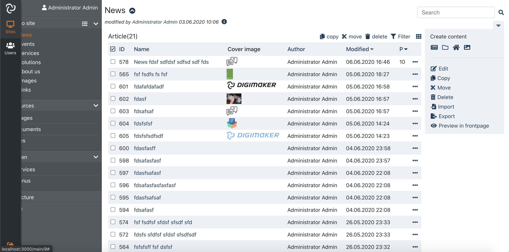
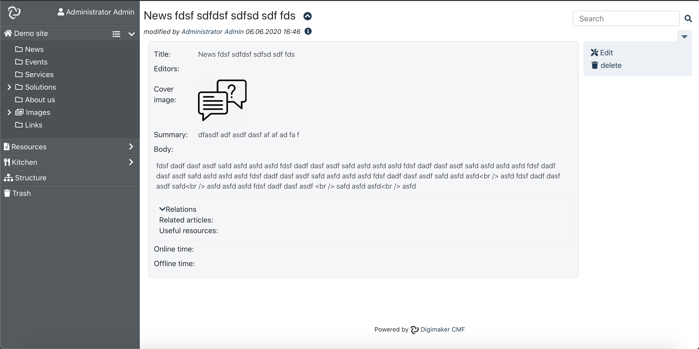

digimaker-eui
=========

digimaker-eui is the editorial ui components for Digimaker framework, developed in React. It provides client features like create, edit, delete, actions.

You can customize it by eg. customizing layout, menu, actions, even embedding edit features into your project or in ui framework(eg. material-ui).

## Current status
Still in development.

## Screenshots

