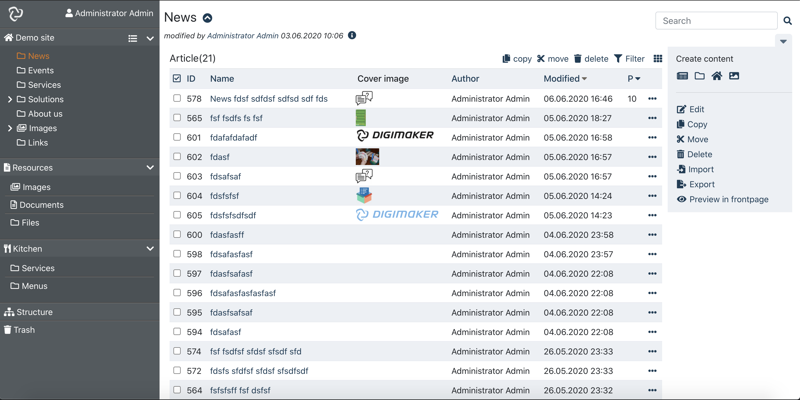

digimaker-eui
=========
digimaker-eui is the editorial ui components for [Digimaker CMF framework](http://github.com/digimakergo/digimaker), developed in React. It provides client features like create, edit, delete, actions and other editorial features.

You can use it directly or by customizing eg. layout, menu, actions, even embedding edit features into your project or in a ui framework(eg. material-ui).

## Current status
Still in development.

## Installation
```
npm -i digimaker-eui
```

### Include your code like below in your App's render method
```jsx
<Router>
<Switch>
    <div className="App">
    <DMInit>
        <Leftmenu />
        <div className="main">
            <MainRoute />
        </div>
        <footer>
        Powered by <a href="http://www.digimaker.org" target="_blank">Digimaker CMF</a>
        </footer>
    <DMInit>
</Switch>
</Router>
```

### Config dm.json
*tba*

## Screenshots




## Related project
[digimaker-ui](https://github.com/digimakergo/ui): a generic client components for developing projects, and is used by this project also.